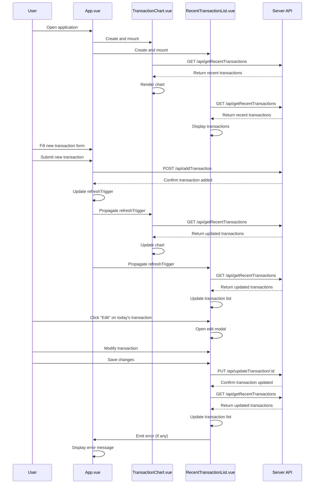

# Transaction Manager

A simple web application for managing daily financial transactions, built with Vue.js and Nuxt.

## Description

Transaction Manager helps you keep track of your daily cash flow. It allows you to add, view, and edit transactions, categorizing them as either "Cash In" or "Cash Out". The app provides a visual representation of your transactions over the past week and a list of recent transactions.

## Features

- Add new transactions with details (date, amount, type, category, and note)
- View a bar chart of Cash In and Cash Out transactions for the past 7 days
- Display a list of recent transactions
- Edit today's transactions
- Responsive design for desktop and mobile use (almost ;p)

## Data Flow Diagram

## Usage

- To add a new transaction, fill out the form at the top of the page and click "Submit"
- View your transaction history in the chart and list below the form
- To edit a transaction from today, click the "Edit" button next to the transaction in the list
- Transactions from previous days are marked as "Synced" and cannot be edited

## Technologies Used

- Vue.js 3
- Nuxt 3
- Chart.js (for data visualization)
- SQLite (for data storage)

## API Endpoints

- `GET /api/getRecentTransactions`: Fetch recent transactions
- `POST /api/addTransaction`: Add a new transaction
- `PUT /api/updateTransaction/:id`: Update an existing transaction

## Contributing

Contributions are welcome! Please feel free to submit a Pull Request.

## License

This project is open source and available under the [MIT License](LICENSE).
